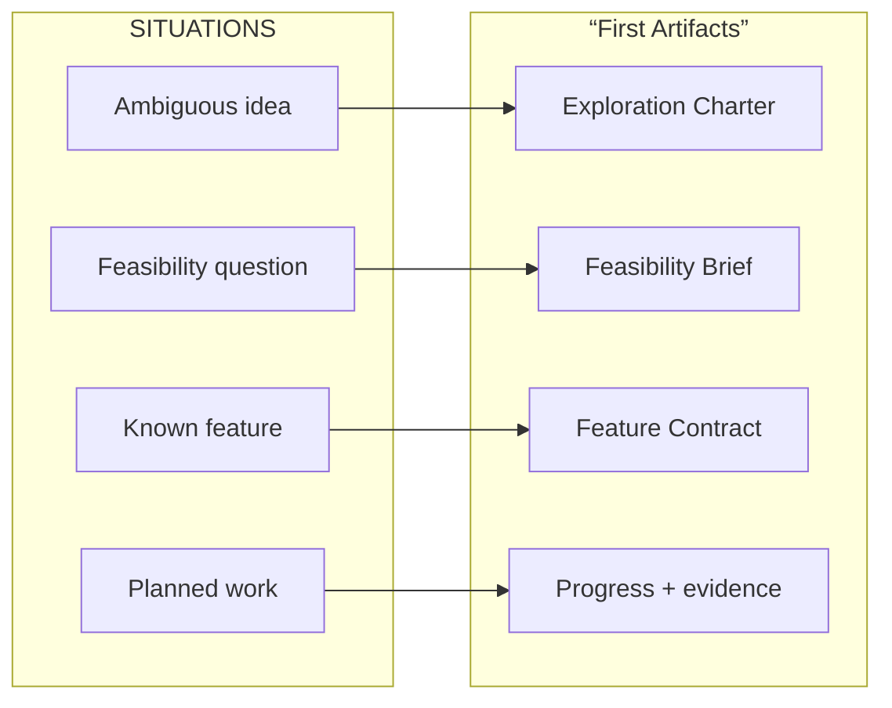
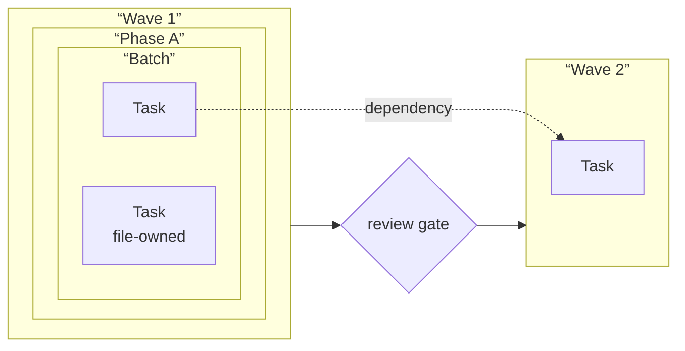

# The Work Is a Graph

## Current imagery and disposition

The current `hero-artifact-graph.jpg`, six deck-slide images, and `evidence-stack.jpg` contain useful concepts but mix presentation framing with article imagery. Replace the hero and consolidate the deck concepts into two editorial figures. A social card is required (not yet present).

---

## Boards

### aof-hero-artifact-path

| Field | Value |
|---|---|
| id | `aof-hero-artifact-path` |
| class | hero |
| surface | essay |
| scheme | signal-dark |
| variant | single |
| aspect | 16:9; 2400x1350 master |
| status | replace-existing (`hero-artifact-graph.jpg`) |

**Placement:** Frontispiece, before the opening paragraph; anchor: `”The Work Is a Graph”`

**Purpose:** Establish that durable artifacts, not the chat transcript, carry operating state — work becomes legible only when it leaves the conversation.

**EXACT ON-IMAGE TEXT:**
- `THE WORK IS A GRAPH`
- `intent`
- `route`
- `artifact`
- `execute`
- `review`
- `evidence`

**Element list with positions:**
- ground: signal-dark canvas (`--s2s-canvas`)
- title “THE WORK IS A GRAPH”: upper-left, ~10% x / 12% y
- lower-left (~15% x / 70% y): dim/faded transcript fragment (subordinate, struck-through or dimmed)
- center horizontal band (20%-80% x / 45% y): luminous six-stop path connecting labeled nodes left to right
- node sequence: [intent] -> [route] -> [artifact] -> [execute] -> [review] -> [evidence]
- transcript fragment has a visual “x” or strikethrough to indicate it is NOT the path
- right edge (~85% x / 45% y): sealed/closed evidence record icon
- large negative space above and below path

**Layout diagram:**
```
+-------------------------------------------------------------------+
| THE WORK IS A GRAPH                                               |
|                                                                   |
|                                                                   |
|   [transcript                                                     |
|   --crossed--]  [intent]-o-[route]-o-[artifact]-o-[execute]-o    |
|                                               -o-[review]-o-[evidence]|
|                                                                   |
|                                                                   |
+-------------------------------------------------------------------+
```

**Conceptual diagram:**


```mermaid
flowchart LR
  T[transcript\ncrossed out] -. not the path .-> A
  A[intent] --> B[route] --> C[artifact] --> D[execute] --> E[review] --> F[evidence]
  style T fill:#1e293b,stroke:#475569,color:#64748b
  style F fill:#1e3a5f,stroke:#3b82f6
```

**Scheme role slots:** ground=`--s2s-canvas`, ink=`--s2s-ink`, accent-1=`--s2s-accent` (path luminous glow), accent-2=`--s2s-secondary` (connector waypoints), muted=`--s2s-ink-muted` (transcript fragment)

**Variant flag:** single

**Alt:** A luminous artifact path moves from intent to evidence across a dark field, with a faded transcript struck out on the left.

**Caption:** Work becomes durable when its state can leave the transcript.

**Generator prompt:** Registry-Wave-aligned dark editorial systems illustration; signal-dark canvas; sparse luminous six-stop artifact path labeled exactly intent/route/artifact/execute/review/evidence; dim crossed-out transcript fragment lower-left; sealed evidence record right; large negative space; no product UI, no people.

**Negative prompt:** people, robots, stock office scenes, logos, illegible microtext, decorative arrows without labels, dense background texture.

**Acceptance checks:**
- All seven labels readable at article width (1200px)
- Direction of path left-to-right is unambiguous
- Transcript fragment is visually subordinate and marked as NOT the path
- One thesis only; no extra elements competing for attention

---

### aof-first-artifact-route

| Field | Value |
|---|---|
| id | `aof-first-artifact-route` |
| class | figure |
| surface | essay |
| scheme | paper-light |
| variant | dark+light pair |
| aspect | 16:9; 2000x1125 master |
| status | replace-existing |

**Placement:** After the “Route to the First Artifact” section; anchor: `”The first decision is not which model to use.”`

**Purpose:** Map four work situations to their first durable artifact, making the routing decision visible before any executor is chosen.

**EXACT ON-IMAGE TEXT:**
- `SITUATION`
- `FIRST ARTIFACT`
- `route before execute`
- `Ambiguous idea`
- `Exploration Charter`
- `Feasibility question`
- `Feasibility Brief`
- `Known feature`
- `Feature Contract`
- `Planned work`
- `Progress + evidence`

**Element list with positions:**
- header row (~8% y): “SITUATION” label left zone; arrow center; “FIRST ARTIFACT” label right zone; “route before execute” small annotation at top-right
- four horizontal rows (~20%, 40%, 60%, 80% y): situation card left -> directional arrow center -> artifact card right
- row 1: “Ambiguous idea” -> “Exploration Charter”
- row 2: “Feasibility question” -> “Feasibility Brief”
- row 3: “Known feature” -> “Feature Contract”
- row 4: “Planned work” -> “Progress + evidence”
- situation cards: accent-1 border (blue)
- artifact cards: accent-2 border (copper/orange)
- arrows: accent-1 color, horizontal, center-band

**Layout diagram:**
```
+-------------------------------------------------------------------+
|   SITUATION              -->           FIRST ARTIFACT            |
|                                              route before execute |
|                                                                   |
|  [Ambiguous idea]    -------->    [Exploration Charter]          |
|                                                                   |
|  [Feasibility question]  ---->    [Feasibility Brief]            |
|                                                                   |
|  [Known feature]    ---------->    [Feature Contract]            |
|                                                                   |
|  [Planned work]     ---------->    [Progress + evidence]         |
+-------------------------------------------------------------------+
```

**Conceptual diagram:**


**Scheme role slots:** ground=paper-light, ink=`--s2s-ink`, accent-1=`--s2s-accent` (situation borders, arrows), accent-2=`--s2s-secondary` (artifact borders), annotation=`--s2s-accent-label`

**Variant flag:** dark+light pair (situation cards and artifact cards use color semantics that need contrast in both modes)

**Alt:** A four-row routing table maps work situations — ambiguous idea, feasibility question, known feature, planned work — to their first artifacts.

**Caption:** Route work to its first artifact before choosing its executor.

**Generator prompt:** Clean Registry Wave routing plate; four horizontal routing rows; rounded cards with thin rules; accent-1 situation borders; accent-2 artifact borders; exact labels; paper-light ground.

**Negative prompt:** dashboard chrome, generic icons, excess nodes, invented situation labels, flow chart clutter.

**Acceptance checks:**
- All ten label strings present and exact
- Four mappings visually unambiguous (no crossing arrows)
- Readable at 680px column width
- “route before execute” annotation present

---

### aof-execution-graph

| Field | Value |
|---|---|
| id | `aof-execution-graph` |
| class | figure |
| surface | essay |
| scheme | paper-light |
| variant | single |
| aspect | 16:9; 2000x1125 master |
| status | replace-existing |

**Placement:** After the “Execution Is a Graph” section; anchor: `”Execution is a graph.”`

**Purpose:** Make dependency-safe parallelism inspectable: waves contain phases contain batches contain tasks; a review gate divides waves; dependencies cross batch boundaries.

**EXACT ON-IMAGE TEXT:**
- `EXECUTION GRAPH`
- `Wave`
- `Phase`
- `Batch`
- `Task`
- `dependency`
- `file ownership`
- `review gate`

**Element list with positions:**
- title “EXECUTION GRAPH”: upper-left, ~5% x / 10% y
- outer container: “Wave 1” band (full width, ~15-70% y)
- inside Wave 1: “Phase A” container; inside Phase A: “Batch” container containing two “Task” nodes
- right edge of Wave 1 (~70% x): “review gate” vertical bar with label
- right side: “Wave 2” band begins after gate (~75-95% x)
- one “dependency” labeled diagonal arrow crossing from a task in Wave 1 to a node in Wave 2
- “file ownership” annotation on one task node
- nested containers use thin rounded-rect borders with ink/muted colors

**Layout diagram:**
```
+-------------------------------------------------------------------+
| EXECUTION GRAPH                                                   |
|                                                                   |
| +-- Wave 1 ------------------------------------------------+  |  |
| |  +-- Phase A --------------------+                        |  |  |
| |  |  +-- Batch --------+          |                        |  |  |
| |  |  |  [Task] [Task]  |          |                        |  |  |
| |  |  |  file ownership |          |                        |  |  |
| |  |  +----------------+          |                        |  |  |
| |  +----------------------------+  |                        |  |  |
| +------------------------------------------------+  [gate]  |  |  |
|                                                  |  review   |  |  |
|                                                  |  gate     |  +--+
|                                    dependency -> |  Wave 2:  |     |
|                                    (arrow)       |  [...]    |     |
+-------------------------------------------------------------------+
```

**Conceptual diagram:**


**Scheme role slots:** ground=paper-light, ink=`--s2s-ink`, accent-1=`--s2s-accent` (gate bar, dependency arrow), muted=`--s2s-ink-muted` (container borders), annotation=`--s2s-accent-label`

**Variant flag:** single

**Alt:** A nested execution graph shows a wave containing a phase containing a batch of two tasks, with a review gate separating waves and a dependency arrow crossing to the next wave.

**Caption:** Parallelism needs ownership and dependency boundaries.

**Generator prompt:** Sparse Registry Wave explanatory diagram; nested containers (wave, phase, batch, task); one labeled dependency connector crossing wave boundary; review gate vertical bar; exact labels; paper-light ground.

**Negative prompt:** slide-deck framing, swimlane clutter, unlabelled lines, circular arrows.

**Acceptance checks:**
- Hierarchy levels (wave > phase > batch > task) all visible and labeled
- Review gate divides waves
- Dependency arrow labeled and visibly crosses a container boundary
- No false implied dependencies from layout

---

### aof-social-card

| Field | Value |
|---|---|
| id | `aof-social-card` |
| class | social-card |
| surface | essay |
| scheme | signal-dark |
| variant | single |
| aspect | 1.91:1; 2400x1260 master / 1200x630 render |
| status | required, does not yet exist |

**Placement:** OG/metadata asset for the essay URL. Target: `public/og/posts/agentic-operations-flow.png`

**Purpose:** Represent the essay in social feeds and link previews.

**EXACT ON-IMAGE TEXT:**
- `The Work Is a Graph`
- `How Agentic Operations Actually Run`
- `Signal to System`

**Element list with positions:**
- ground: signal-dark canvas
- title “The Work Is a Graph”: centered, within 70% safe zone
- subtitle “How Agentic Operations Actually Run”: below title
- S2S mark: corner

**Layout diagram:**
```
+-------------------------------------------------------------------+
|                                                                   |
|   [S2S mark]                                                      |
|                                                                   |
|             The Work Is a Graph                                   |
|        How Agentic Operations Actually Run                       |
|                                                                   |
|                                          [Signal to System]      |
+-------------------------------------------------------------------+
```

**Scheme role slots:** ground=`--s2s-canvas`, ink=`--s2s-ink`, accent-1=`--s2s-accent`

**Alt:** (metadata only)

**Generator prompt:** Dark editorial social card; signal-dark canvas; essay title and subtitle centered in 70% safe zone; S2S mark; subtle artifact-path motif; no dense diagram.

**Negative prompt:** paper-light background, dense infographic, baked body copy, logos other than S2S mark.

**Acceptance checks:**
- Title and subtitle readable at 1200x630 render
- Within central 70% safe zone
- PNG under 350KB
