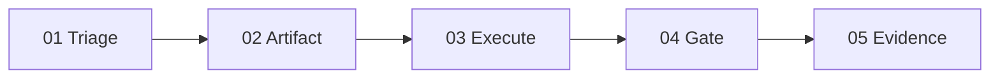
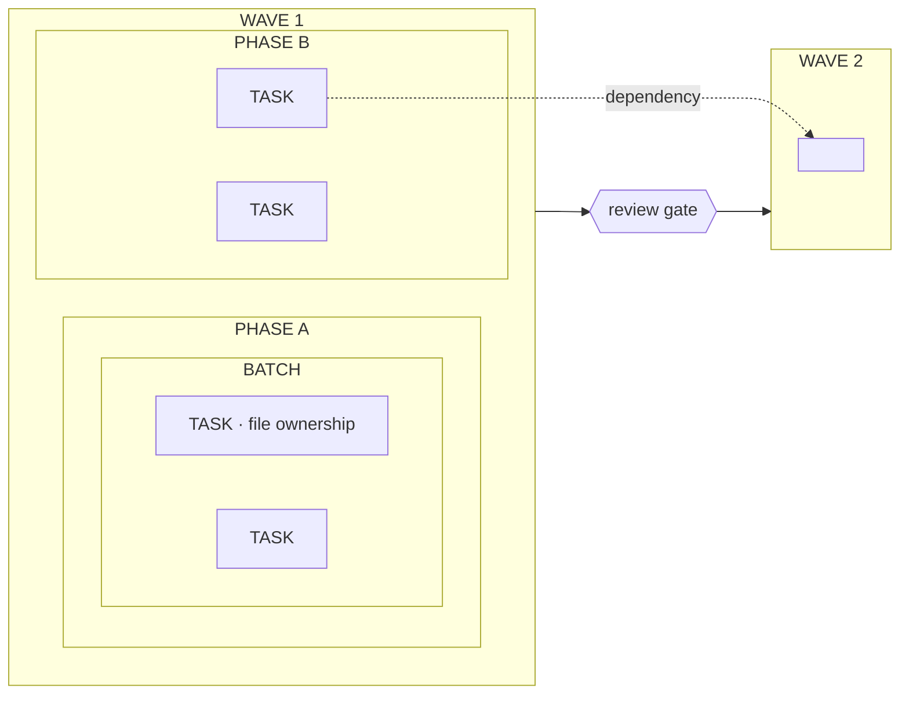

# The Work Is a Graph — storyboard

Essay: `src/content/posts/agentic-operations-flow.mdx` ("The Work Is a Graph: How Agentic
Operations Actually Run"). Templates and checklist: `00-style-reference.md`.

## Disposition (every current image accounted for)

| Current | Fig | Section | Decision |
|---|---|---|---|
| `hero-artifact-graph.jpg` | hero | frontispiece | **Replace** with `aof-hero` (pair) |
| `deck/slide-04-work-is-a-graph.jpg` | 01 | opening | **Cut.** The new hero states this thesis and the interactive follows immediately. |
| `deck/slide-05-operating-loop.jpg` | 02 | Chat Is the Wrong Container | **Cut.** Its own caption says the interactive redraws it for the web. |
| `deck/slide-10-triage-decision.jpg` | 03 | Triage Before Commitment | **Replace** with `aof-plate-01-triage` |
| `deck/slide-13-tiered-autonomy.jpg` | 04 | Autonomy Scales With Risk | **Replace** with `aof-plate-02-autonomy` |
| `deck/slide-17-execution-graph.jpg` | 05 | Execution Is a Graph | **Replace** with `aof-plate-03-execution` |
| `deck/slide-25-mode-d-boundary.jpg` | 06 | Gates Are Typed | **Replace** with `aof-plate-04-gates` |
| `evidence-stack.jpg` | 07 | Evidence Is Part of the Deliverable | **Replace** with `aof-plate-05-evidence` |

Result: the essay's deck slides become one serial family, "The Work Is a Graph — 01 to 05", the
same device the Registry Wave uses for its thread. Figure numbers in the MDX renumber 01-05 (an
MDX edit for whoever lands the images; not part of this handoff).

## Family constants (all five plates)

- Template: **T2 serial-plate** (`00-style-reference.md` §4). 16:9, 2000x1125 master, paper-light, single.
- Eyebrow: `THE WORK IS A GRAPH`
- Corner stacks: TL `ROUTE / ARTIFACT / GATE / EVIDENCE` · TR `WORK THAT / OUTLIVES THE / SESSION` ·
  BL `INTENT / TRIAGE / TIERS / WAVES` · BR `REVIEW / RECORD / REUSE / COMPOUND`
- Backbone (five reticles, same on every plate; only state changes):

| # | Name | Sub-line | Icon |
|---|---|---|---|
| 01 | `Triage` | `Name the uncertainty.` | branching fork |
| 02 | `Artifact` | `The first durable output.` | document |
| 03 | `Execute` | `Bounded, owned work.` | three stacked boxes |
| 04 | `Gate` | `Typed review.` | shield outline |
| 05 | `Evidence` | `The record that stays.` | document with check |



On each plate the named node is **active** (heavier ring, highlight fill); all others inactive.
Exact text on every plate = eyebrow + corner stacks + the ten backbone strings above + the
board's own strings below.

---

## aof-hero — the transcript and the graph

| Field | Value |
|---|---|
| class / surface | hero / essay |
| template | T1 atelier-hero + §3 night twin |
| scheme / variant | paper-light master + signal-dark twin / dark+light pair |
| master | 16:9, 2400x1350 |
| exact text | none |
| targets | `public/images/agentic-operations-flow/hero/agentic-operations-flow--hero--transcript-to-graph--{paper-light,signal-dark}.{avif,webp}` |

**Purpose:** the essay's opening image: "a storage bin with a conversation attached" versus work
that leaves durable artifacts behind.

**Composition:**
- A long studio workbench runs left to right across the lower half.
- **Left third:** one person at the end of the bench unspooling an endless paper scroll (the
  transcript). It curls off the bench and piles on the floor, loose and unread; its end fades into
  the paper. No writing legible on it. Nothing from the overlay touches it.
- **Centre and right:** four people at stations along the bench, each holding or working on a
  distinct physical artifact: a folded charter, a drafting sheet, a small stack of three boxes, a
  stamped sheet with a check. Each hands to the next.
- **Overlay (focal):** above the four stations, five small reticle badges drawn in ink, joined by
  curved lines with copper-centred waypoints, one badge over each station and a fifth at the right
  holding a document-with-check. Dashed drop-lines from badges to hands. The overlay starts where
  the scroll ends.
- Crop safety: the overlay's centre badge sits at frame centre; the scroll may fall out of the
  4:3 and 1:1 crops.

```
+----------------------------------------------------------------------+
|                 o~~~~o~~~~o~~~~o~~~~o       (ink overlay, in the air) |
|                 :    :    :    :    :                                 |
|  [scroll ~~~]   [ch] [sh] [bx] [st] [ev]                              |
|  ~~~~ floor     === long workbench, four people handing along ===    |
+----------------------------------------------------------------------+
```

**Prompt (after T1):** the scene above; the scroll is plain paper, the only unstructured thing
in the room; the overlay is a clean line of five badges; accent-1 cobalt on the stack of boxes,
accent-2 copper on the waypoints.

**Negative (after T1):** chat bubbles, speech balloons, screens, legible writing on the scroll.

**Night twin:** §3; the scroll stays unlit and dim, the lamps fall on the four stations only.

**Alt:** decorative (empty). **Checks:** reads as "loose scroll vs a line of handed-on objects"
in two seconds; overlay is over the stations only; no text; twin matches master geometry.

---

## aof-plate-01-triage (replaces Fig 03)

**Placement:** "Triage Before Commitment", after the situation table. Active node: `01`.

**Exact text:**
- Title: `The Work Is a Graph — 01 Triage` (accent phrase: `01 Triage`)
- Subtitle: `Different uncertainty needs a different first artifact.`
- Lower-section headers: `SITUATION` · `FIRST DURABLE OUTPUT`
- Rows: `Ambiguous idea` → `Exploration Charter` · `Feasibility question` → `FeasibilityBrief` ·
  `Known feature` → `Feature Contract or PRD` · `Planned phase` → `Updated progress and evidence`
- Footer tagline: `ROUTE TO THE FIRST ARTIFACT, NOT THE LAST.`

**Lower section:** a bordered panel with two columns. Four rows; each row = a small inactive
reticle + situation (bold serif) on the left, a waypoint connector, and a document icon + output
(bold serif) on the right. Rows are parallel; no crossing lines.

```
| SITUATION                         FIRST DURABLE OUTPUT       |
| (o) Ambiguous idea      --o-->    [doc] Exploration Charter  |
| (o) Feasibility question--o-->    [doc] FeasibilityBrief     |
| (o) Known feature       --o-->    [doc] Feature Contract or PRD |
| (o) Planned phase       --o-->    [doc] Updated progress and evidence |
```

**Alt:** "Serial plate: triage is the first step. Four situations map to their first durable
output: ambiguous idea to Exploration Charter, feasibility question to FeasibilityBrief, known
feature to Feature Contract or PRD, planned phase to updated progress and evidence."
**Caption:** `Triage decides what kind of uncertainty the work carries before anyone edits a file.`
**Checks:** four rows exact; `FeasibilityBrief` one word; node 01 active only.

---

## aof-plate-02-autonomy (replaces Fig 04)

**Placement:** "Autonomy Scales With Risk", after the tier table. Active nodes: `02` and `04`
(tiers set the artifact burden and the gate).

**Exact text:**
- Title: `The Work Is a Graph — 02 Autonomy`
- Subtitle: `Autonomy is earned by scope, uncertainty, and risk.`
- Headers: `TIER` · `PLANNING ARTIFACT` · `REVIEW GATE`
- `Tier 0` `Tiny safe change` · `Inline plan` · `Optional reviewer`
- `Tier 1` `Bounded feature` · `Feature Contract` · `Mandatory validator`
- `Tier 2` `Coordinated work` · `PRD + Implementation Plan` · `Per-phase validation`
- `Tier 3` `High-risk work` · `SPIKE, PRD, plan, milestone gates` · `Council`
- Footer: `AUTONOMOUS RELATIVE TO WHAT?`

**Lower section:** a four-step staircase rising left to right; each step a card with tier label
(mono) and shape (serif), and below it the artifact and gate in two small sans lines. Step
borders thicken with tier; no traffic-light colors (risk is shown by weight, not red).

**Alt:** "Serial plate: four autonomy tiers rise as a staircase; each higher tier carries a
heavier planning artifact and a stronger review gate, from inline plan and optional reviewer at
Tier 0 to SPIKE, PRD, plan and milestone gates with council review at Tier 3."
**Caption:** `The tier sets the artifact burden and the review intensity, not the model.`
**Checks:** 12 cell strings exact; staircase ascends; no red/yellow/green ladder.

---

## aof-plate-03-execution (replaces Fig 05)

**Placement:** "Execution Is a Graph", after the ExecutionGraph code block. Active node: `03`.

**Exact text:**
- Title: `The Work Is a Graph — 03 Execution`
- Subtitle: `Parallelism needs ownership and dependency boundaries.`
- Labels: `WAVE 1` · `WAVE 2` · `PHASE A` · `PHASE B` · `BATCH` · `TASK` (x4) · `file ownership` ·
  `dependency` · `review gate`
- Footer: `USEFUL PARALLELISM WITHOUT A MERGE-CONFLICT COORDINATOR.`

**Lower section:** left 70%: a `WAVE 1` container holding `PHASE A` and `PHASE B` side by side
(parallel); inside `PHASE A` a `BATCH` holding two `TASK` cards, one tagged `file ownership`
with a small lock; `PHASE B` holds two `TASK` cards. A vertical navy bar labelled `review gate`
separates it from a narrower `WAVE 2` container on the right (one empty task outline). One dashed
connector labelled `dependency` (italic serif) runs from a `PHASE B` task, through the gate, into
`WAVE 2`. Containers are thin rounded rules; nesting reads by inset, not color.



**Alt:** "Serial plate: an execution graph. Wave 1 holds two parallel phases; Phase A groups two
tasks into a batch by file ownership. A review gate separates Wave 1 from Wave 2, and one
dependency crosses it."
**Caption:** `Waves serialize, phases parallelize, batches keep file ownership from colliding.`
**Checks:** nesting wave > phase > batch > task visible; exactly one dependency, crossing the gate.

---

## aof-plate-04-gates (replaces Fig 06)

**Placement:** "Gates Are Typed", after the Mode D callout. Active node: `04`.

**Exact text:**
- Title: `The Work Is a Graph — 04 Gates`
- Subtitle: `Review is typed. A hard boundary is not a prompt style.`
- Three lanes: `standard` `task-completion-validator` · `tier3` `Higher-risk validator` ·
  `council` `Review council`
- Brake bar: `MODE D` · `Stop before edits.` · `auth · payments · deletion · migrations`
- Footer: `IT MAY FEEL SLOWER. IT IS SUPPOSED TO.`

**Lower section:** three horizontal lanes stacked, each: a mono lane key on the left, a reticle
gate icon, reviewer name in serif; lane rules get heavier downward. Below them, full width, a
state-danger banner (rounded rect, pale red fill, red ring-X reticle at left) carrying the Mode D
strings. The banner visibly blocks the connector line that runs into it.

**Alt:** "Serial plate: three typed review lanes, standard, tier3 and council, sit above a red
Mode D banner that stops the workflow before edits for auth, payments, deletion and migrations."
**Caption:** `Mode D is a brake: the workflow stops before edits and asks for signoff.`
**Checks:** lane keys in mono; banner is the only red element; connector ends at the banner.

---

## aof-plate-05-evidence (replaces Fig 07)

**Placement:** "Evidence Is Part of the Deliverable", after the layer table. Active node: `05`.

**Exact text:**
- Title: `The Work Is a Graph — 05 Evidence`
- Subtitle: `The work is done when the system can explain what happened.`
- Layers (top to bottom) with what they keep: `Progress state` `status, blockers, phase` ·
  `Validation record` `checks, reviews, criteria` · `Run intelligence` `traces, failures, time` ·
  `Human capsule` `a readable summary` · `Knowledge surface` `decisions and reusable patterns`
- Footer: `EVIDENCE IS THE PRODUCT OF THE RUN, NOT ITS CLEANUP.`

**Lower section:** five stacked paper sheets in slight perspective (flat, drawn, not 3D render),
each with a small reticle icon and serif name at left and the sans phrase at right. A single
accent-2 waypoint line runs down the left edge through all five, ending at the backbone node 05.

**Alt:** "Serial plate: five evidence layers stack under the evidence step: progress state,
validation record, run intelligence, human capsule and knowledge surface."
**Caption:** `Progress, validation, telemetry, capsules and knowledge are the deliverable too.`
**Checks:** five layers in order; no 3D block render; one accent line only.

---

## aof-social — social art

| Field | Value |
|---|---|
| class | social-card (art plate) |
| template | social-art: recrop of the approved `aof-hero` night twin |
| master | 1520x1260, signal-dark, single, no text |
| target | `public/images/agentic-operations-flow/social/agentic-operations-flow--social-card--art.jpg` |

Recompose so the five-badge overlay sits in the right 60% and the lamplit stations below it;
the scroll may be lost. The renderer (`src/lib/og/render.ts`) sets title and mark.
**Checks:** no text; reads at 760x630; under 300 KB.
