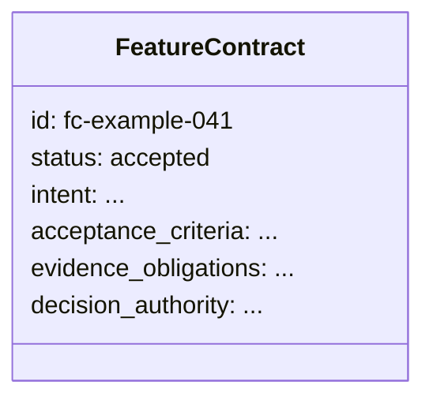
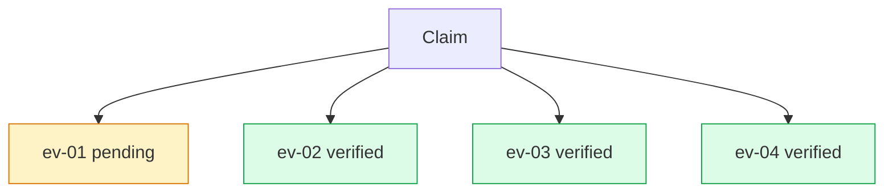

# Companion Example: A Fully Populated Feature Contract

## Current imagery and disposition

No current image assets. The companion is intentionally text-first. Both proposals are **optional net-new** explanatory plates. A social card is required (not yet present, also optional-net-new given this companion essay may share the social card with the parent).

---

## Boards

### worked-contract-record — optional net-new

| Field | Value |
|---|---|
| id | `worked-contract-record` |
| class | figure |
| surface | essay |
| scheme | paper-light |
| variant | single |
| aspect | 4:3; 1800x1350 master |
| status | optional net-new |

**Placement:** After the opening contract block in the essay; anchor: `”Feature Contract: fc-example-041”`

**Purpose:** Let the reader scan a fully-populated contract record's obligatory fields as one unified object, showing what “inspectable” means in practice.

**EXACT ON-IMAGE TEXT:**
- `fc-example-041`
- `Status: accepted`
- `Intent`
- `Acceptance criteria`
- `Evidence obligations`
- `Decision authority`

**Element list with positions:**
- top row (~8% y): “fc-example-041” identifier left (monospace); “Status: accepted” badge right (green)
- horizontal rule below top row
- four vertically stacked field blocks (~15-85% y):
  - “Intent” label with empty content zone (no invented prose)
  - “Acceptance criteria” label with empty content zone
  - “Evidence obligations” label with empty content zone
  - “Decision authority” label with empty content zone
- horizontal rules between each field block
- right edge: accent vertical rule to indicate “required field” (thin, accent-1 color)
- bottom strip: rule-separated evidence status row

**Layout diagram:**
```
+-----------------------------------+
| fc-example-041        [accepted]  |
+-----------------------------------+
| Intent                            |
|   [content zone]                  |
+-----------------------------------+
| Acceptance criteria               |
|   [content zone]                  |
+-----------------------------------+
| Evidence obligations              |
|   [content zone]                  |
+-----------------------------------+
| Decision authority                |
|   [content zone]                  |
+-----------------------------------+
```

**Conceptual diagram:**


**Scheme role slots:** ground=paper-light, ink=`--s2s-ink`, accent-1=`--s2s-accent` (required-field side rule, accepted badge), muted=`--s2s-ink-muted` (horizontal rules), annotation=`--s2s-accent-label` (ID monospace)

**Variant flag:** single

**Alt:** A structured feature-contract record labeled fc-example-041 with status accepted, showing four vertically stacked field sections: Intent, Acceptance criteria, Evidence obligations, Decision authority.

**Caption:** A contract is inspectable when its obligations are visible together.

**Generator prompt:** Registry Wave document-as-evidence plate; 4:3 portrait; monospaced record identifier at top; status badge; four rule-separated labeled field blocks; disciplined whitespace; no invented contract prose inside fields; semantic role-slot accents on required-field indicators; paper-light ground.

**Negative prompt:** invented contract prose, handwriting, legal-document clichés, UI chrome, lorem ipsum, fill-in-the-blank placeholders.

**Acceptance checks:**
- Only the six supplied label strings baked in (no invented prose)
- Record ID in monospace
- Status “accepted” badge distinguishable from other fields
- Image is secondary to the surrounding source text in the essay
- Readable at article column width (~680px)

---

### worked-claim-binding — optional net-new

| Field | Value |
|---|---|
| id | `worked-claim-binding` |
| class | figure |
| surface | essay |
| scheme | paper-light |
| variant | single |
| aspect | 16:9; 2000x1125 master |
| status | optional net-new |

**Placement:** After the “Claims bound to evidence” passage; anchor: `”Claims are bound to evidence.”`

**Purpose:** Show that evidence records attach to specific claims and each carries a discrete verification state — evidence should bind to the claim, not merely surround it.

**EXACT ON-IMAGE TEXT:**
- `Claim`
- `criterion 1`
- `criterion 3`
- `ev-01 pending`
- `ev-02 verified`
- `ev-03 verified`
- `ev-04 verified`

**Element list with positions:**
- upper center (~50% x / 20% y): “Claim” card (primary, accent border)
- below it: one connector branching down to four evidence record rows
- four horizontal evidence rows (~25%, 42%, 58%, 75% y from left to right):
  - row 1 (~30% y): “ev-01 pending” — pending state (amber indicator)
  - row 2 (~45% y): “ev-02 verified” — verified state (green indicator)
  - row 3 (~60% y): “ev-03 verified” — verified state (green indicator)
  - row 4 (~75% y): “ev-04 verified” — verified state (green indicator)
- left edge: “criterion 1” label (which criteria this evidence supports)
- right edge: “criterion 3” label (which criteria)
- state markers at each row right end: pending = amber circle; verified = green circle
- connector lines: upward from each evidence row to the claim card

**Layout diagram:**
```
+-------------------------------------------------------------------+
|                          [Claim]                                 |
|                         /  |  \  \                               |
|                        /   |   \  \                             |
| criterion 1 [ev-01 pending  --------]  (amber)                  |
| criterion 1 [ev-02 verified ---------] (green)                  |
| criterion 3 [ev-03 verified ---------] (green)                  |
| criterion 3 [ev-04 verified ---------] (green)                  |
+-------------------------------------------------------------------+
```

**Conceptual diagram:**


**Scheme role slots:** ground=paper-light, ink=`--s2s-ink`, accent-1=`--s2s-accent` (Claim card border, connector), highlight=`--s2s-accent-strong` (verified state), annotation=`--s2s-accent-label` (ev-IDs in monospace), muted=amber for pending state

**Variant flag:** single

**Alt:** A “Claim” card at top connects downward to four evidence records: ev-01 shown as pending in amber, ev-02 through ev-04 shown as verified in green.

**Caption:** Evidence should attach to the claim, not merely surround it.

**Generator prompt:** Registry Wave evidence-provenance diagram; sparse four-row layout; claim card at top center; connector lines down to four evidence records; pending/verified state semantics differ beyond color alone (shape or label); exact label strings only; paper-light ground.

**Negative prompt:** fabricated evidence IDs beyond the supplied labels, checkmark overload, dashboards, invented acceptance criteria text.

**Acceptance checks:**
- All seven label strings present and exact
- Pending and verified states differ by more than color (use shape or label variant as well)
- No factual assertion beyond the illustrative record structure
- Connector from Claim to each evidence record is directional (downward) and explicit

---

### worked-example-social-card — optional net-new

| Field | Value |
|---|---|
| id | `worked-example-social-card` |
| class | social-card |
| surface | essay |
| scheme | signal-dark |
| variant | single |
| aspect | 1.91:1; 2400x1260 master / 1200x630 render |
| status | optional net-new (companion post may use parent essay social card instead) |

**Placement:** OG/metadata asset. Target: `public/og/posts/contract-as-spec-worked-example.png`

**EXACT ON-IMAGE TEXT:**
- `A Fully Populated Feature Contract`
- `Contract as Spec`
- `Signal to System`

**Layout diagram:**
```
+-------------------------------------------------------------------+
| [S2S mark]                                                        |
|                                                                   |
|           A Fully Populated Feature Contract                     |
|                    Contract as Spec                              |
|                                                                   |
|                                         [Signal to System]       |
+-------------------------------------------------------------------+
```

**Scheme role slots:** ground=`--s2s-canvas`, ink=`--s2s-ink`, accent-1=`--s2s-accent`

**Alt:** (metadata only)

**Generator prompt:** Dark editorial social card; companion post title and series centered in 70% safe zone; signal-dark canvas; subtle contract-record motif; S2S mark.

**Negative prompt:** paper-light background, dense infographic, legal imagery.

**Acceptance checks:**
- Title readable at 1200x630 render within central 70% safe zone
- PNG under 350KB
