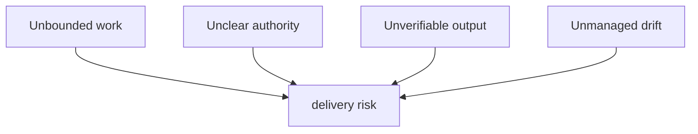
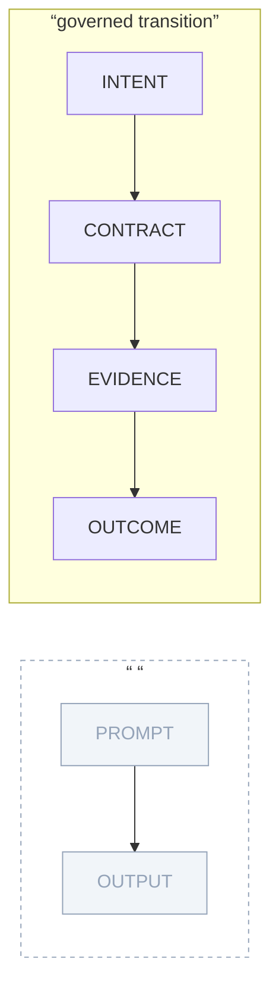

# The Productivity Paradox

## Current imagery and disposition

Current hero `hero-02-missing-layer.jpeg`, `diagram-four-failures.jpeg`, `diagram-transitions.jpeg`, and `hero-03-swarm-gate.jpeg` cover the argument but combine metaphorical hero treatments and diagrams. Retain their subject matter; re-art-direct the hero and two core explanatory plates as a Registry Wave-aligned family. A social card is required (not yet present).

---

## Boards

### productivity-hero-control-gap

| Field | Value |
|---|---|
| id | `productivity-hero-control-gap` |
| class | hero |
| surface | essay |
| scheme | signal-dark |
| variant | single |
| aspect | 16:9; 2400x1350 master |
| status | replace-existing (`hero-02-missing-layer.jpeg`) |

**Placement:** Frontispiece, before the opening paragraph; anchor: `”The Productivity Paradox”`

**Purpose:** Show that autonomous capability without a governance layer creates a structural control gap — the missing layer, not weak models, is the problem.

**EXACT ON-IMAGE TEXT:**
- `CAPABILITY`
- `CONTROL`
- `THE MISSING LAYER`

**Element list with positions:**
- ground: signal-dark canvas
- left mass (~15-35% x / 30-70% y): “CAPABILITY” labeled block — luminous, stable geometry
- right mass (~65-85% x / 30-70% y): “CONTROL” labeled block — luminous, stable geometry
- center gap (~45-55% x / 45-55% y): incomplete bridge or interrupted connection structure
- “THE MISSING LAYER” label sits over the gap, ~50% x / 40% y
- large negative space above and below, no decorative clutter

**Layout diagram:**
```
+-------------------------------------------------------------------+
|                                                                   |
|                                                                   |
|   [CAPABILITY]    ==broken bridge==  THE MISSING LAYER  [CONTROL]|
|    (luminous)     ====gap====                            (luminous)|
|                                                                   |
|                                                                   |
+-------------------------------------------------------------------+
```

**Conceptual diagram:**


**Scheme role slots:** ground=`--s2s-canvas`, ink=`--s2s-ink`, accent-1=`--s2s-accent` (CAPABILITY glow), accent-2=`--s2s-secondary` (gap annotation), highlight=`--s2s-accent-strong` (CONTROL glow)

**Variant flag:** single

**Alt:** A luminous “CAPABILITY” mass and a “CONTROL” mass face each other across an incomplete bridge labeled “THE MISSING LAYER” on a dark field.

**Caption:** More autonomous capability does not supply its own control plane.

**Generator prompt:** Spacious Registry Wave dark conceptual hero; signal-dark canvas; two luminous stable masses labeled CAPABILITY and CONTROL on opposite sides; incomplete bridge between them; “THE MISSING LAYER” over the gap; large negative space; restrained role-slot glow.

**Negative prompt:** robots, factories, people, sci-fi cityscape, generic warning icons, dashboard screenshots, gear icons.

**Acceptance checks:**
- Gap reads immediately before any detail is inspected
- Labels CAPABILITY, CONTROL, THE MISSING LAYER all legible at article width
- No implied solution — only the structural gap
- signal-dark ground; no paper-light bleed

---

### productivity-four-failures

| Field | Value |
|---|---|
| id | `productivity-four-failures` |
| class | figure |
| surface | essay |
| scheme | paper-light |
| variant | dark+light pair |
| aspect | 16:9; 2000x1125 master |
| status | replace-existing (`diagram-four-failures.jpeg`) |

**Placement:** After the four-failures discussion; anchor: `”The failures are structural.”`

**Purpose:** Distinguish four recurring governance failures without turning them into a checklist or traffic-light report.

**EXACT ON-IMAGE TEXT:**
- `FOUR STRUCTURAL FAILURES`
- `Unbounded work`
- `Unclear authority`
- `Unverifiable output`
- `Unmanaged drift`
- `delivery risk`

**Element list with positions:**
- title “FOUR STRUCTURAL FAILURES”: upper center, ~50% x / 10% y
- 2x2 card grid (~15-85% x / 20-75% y):
  - upper-left: “Unbounded work” card with compact failure-state glyph
  - upper-right: “Unclear authority” card with glyph
  - lower-left: “Unverifiable output” card with glyph
  - lower-right: “Unmanaged drift” card with glyph
- from each card: one connector converging downward
- bottom center (~50% x / 85% y): “delivery risk” footer label (muted, not a triumphalist target)

**Layout diagram:**
```
+-------------------------------------------------------------------+
|                 FOUR STRUCTURAL FAILURES                         |
|                                                                   |
|  [Unbounded work]             [Unclear authority]                |
|       |                              |                           |
|       |                              |                           |
|  [Unverifiable output]        [Unmanaged drift]                  |
|       |                              |                           |
|       +----------+   +--------------+                           |
|                  v   v                                           |
|               delivery risk                                      |
+-------------------------------------------------------------------+
```

**Conceptual diagram:**


**Scheme role slots:** ground=paper-light, ink=`--s2s-ink`, accent-1=`--s2s-accent` (card borders), muted=`--s2s-ink-muted` (delivery risk footer), annotation=`--s2s-accent-label`

**Variant flag:** dark+light pair

**Alt:** Four labeled cards — unbounded work, unclear authority, unverifiable output, unmanaged drift — converge downward to a “delivery risk” footer.

**Caption:** The paradox is a set of missing operating constraints, not a model-quality problem.

**Generator prompt:** Registry Wave technical comparison plate; 2x2 card grid; balanced equal-weight cards; compact failure-state glyph in each; thin rules; converging connectors to muted footer; exact labels; paper-light ground.

**Negative prompt:** traffic-light scoring, red/yellow/green color ladder, generic warning triangles, dense prose inside cards, percent figures.

**Acceptance checks:**
- All five label strings present and exact
- Four cards have equal visual weight (no card more alarming than others by size or color)
- Footer “delivery risk” is muted, not a highlighted endpoint
- No causal measurement implied by connector convergence

---

### productivity-governance-transition

| Field | Value |
|---|---|
| id | `productivity-governance-transition` |
| class | figure |
| surface | essay |
| scheme | paper-light |
| variant | single |
| aspect | 16:9; 2000x1125 master |
| status | replace-existing (`diagram-transitions.jpeg`) |

**Placement:** After the governance-transition passage; anchor: `”Governance changes the shape of the work.”`

**Purpose:** Make the shift from a prompt-to-output chain to an intent-to-outcome governed path visible as a structural comparison.

**EXACT ON-IMAGE TEXT:**
- `PROMPT`
- `OUTPUT`
- `INTENT`
- `CONTRACT`
- `EVIDENCE`
- `OUTCOME`
- `governed transition`

**Element list with positions:**
- top path (~20-80% x / 25% y): faded/thin direct arrow “PROMPT -> OUTPUT” — the ungoverned chain
- vertical comparison rule or separator (~50% y): separates the two paths
- bottom path (~20-80% x / 70% y): bright four-stage chain “INTENT -> CONTRACT -> EVIDENCE -> OUTCOME”
- “governed transition” annotation label at ~15% x / 60% y (beside the lower path)
- upper path: muted/grey treatment — diminished weight
- lower path: accent-1 treatment — luminous, primary weight

**Layout diagram:**
```
+-------------------------------------------------------------------+
|                                                                   |
|   [PROMPT] -----------------> [OUTPUT]                           |
|   (faded, thin line, muted)                                      |
|                                                                   |
| ·····················comparison separator·····················   |
|                                                                   |
| governed   [INTENT] ---> [CONTRACT] ---> [EVIDENCE] ---> [OUTCOME]|
| transition                                                        |
|            (bright, primary weight, staged)                      |
|                                                                   |
+-------------------------------------------------------------------+
```

**Conceptual diagram:**


**Scheme role slots:** ground=paper-light, ink=`--s2s-ink`, accent-1=`--s2s-accent` (governed path), muted=`--s2s-ink-muted` (ungoverned faded path), annotation=`--s2s-accent-label`

**Variant flag:** single

**Alt:** A faded direct “PROMPT to OUTPUT” arrow sits above a bright four-stage governed path: INTENT to CONTRACT to EVIDENCE to OUTCOME.

**Caption:** Governance inserts inspectable commitments between request and result.

**Generator prompt:** Minimalist Registry Wave before-and-after flow comparison; one faded thin ungoverned path top; one bright four-stage governed path bottom; explicit vertical separator; exact labels; paper-light ground.

**Negative prompt:** process clip art, product screenshots, excessive arrows, circular flows, checklist bullets.

**Acceptance checks:**
- Comparison legible at a three-second glance
- Lower path has exactly four discrete stages (INTENT / CONTRACT / EVIDENCE / OUTCOME)
- Upper path is clearly subordinate (faded treatment)
- Direction unmistakable left-to-right on both paths

---

### productivity-social-card

| Field | Value |
|---|---|
| id | `productivity-social-card` |
| class | social-card |
| surface | essay |
| scheme | signal-dark |
| variant | single |
| aspect | 1.91:1; 2400x1260 master / 1200x630 render |
| status | required, does not yet exist |

**Placement:** OG/metadata asset. Target: `public/og/posts/governed-agentic-sdlc-01-productivity-paradox.png`

**EXACT ON-IMAGE TEXT:**
- `The AI Productivity Paradox`
- `Governed Agentic SDLC`
- `Signal to System`

**Layout diagram:**
```
+-------------------------------------------------------------------+
| [S2S mark]                                                        |
|                                                                   |
|              The AI Productivity Paradox                         |
|                  Governed Agentic SDLC                           |
|                                                                   |
|                                         [Signal to System]       |
+-------------------------------------------------------------------+
```

**Scheme role slots:** ground=`--s2s-canvas`, ink=`--s2s-ink`, accent-1=`--s2s-accent`

**Alt:** (metadata only)

**Generator prompt:** Dark editorial social card; essay title and series centered in 70% safe zone; signal-dark canvas; subtle control-gap motif; S2S mark.

**Negative prompt:** paper-light background, dense infographic, baked body copy.

**Acceptance checks:**
- Title readable at 1200x630 render within central 70% safe zone
- PNG under 350KB
