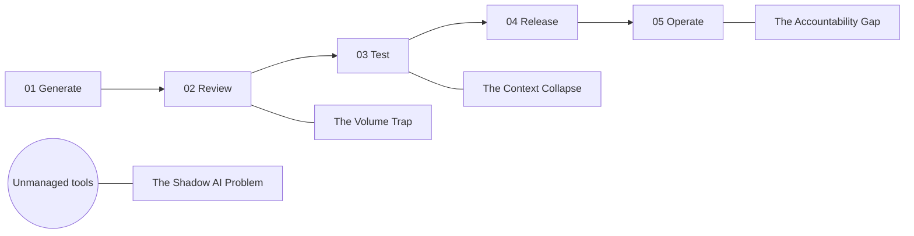

# The AI Productivity Paradox — storyboard

Essay: `src/content/posts/governed-agentic-sdlc-01-productivity-paradox.mdx` (series
`governed-agentic-sdlc`, part 1). Templates and checklist: `00-style-reference.md`.

## Disposition

| Current | Fig | Section | Decision |
|---|---|---|---|
| `hero-02-missing-layer.jpeg` | hero | frontispiece | **Replace** with `pp-hero` (pair) |
| `diagram-four-failures.jpeg` | 01 | Why the Gains Don't Compound | **Replace** with `pp-plate-01-failures` |
| `diagram-transitions.jpeg` | 02 | The Infrastructure Gap | **Replace** with `pp-plate-02-transitions` |
| `hero-03-swarm-gate.jpeg` | 03 | The Infrastructure Gap (gate passage) | **Replace** with `pp-plate-03-gates` |
| `hero-01-divergence.jpeg` | — | not referenced by the MDX | Leave; retire in a cleanup pass |

The first draft invented four failure names ("Unbounded work", "Unclear authority", ...) and
replaced Fig 02 with a prompt-vs-intent diagram the essay does not contain. Both corrected: the
plates below use the essay's own four failure modes and its own three-transition argument.

## Family constants

- Template: T2 serial-plate (plates 01, 02) and T3 comparison-plate (plate 03). 16:9, 2000x1125,
  paper-light, single.
- Eyebrow: `GOVERNED AGENTIC SDLC · PART 1`
- Corner stacks: TL `CAPABILITY / CONTEXT / CONTROL / DELIVERY` · TR `GAINS THAT / ACTUALLY / COMPOUND` ·
  BL `REVIEW / TEST / RELEASE / OPERATE` · BR `SCOPE / TRUST / EVIDENCE / OWNERSHIP`
- Footer rule style as the family; tagline per board.

---

## pp-hero — the fast benches and the narrow door

| Field | Value |
|---|---|
| class / surface | hero / essay |
| template | T1 atelier-hero + §3 night twin |
| scheme / variant | paper-light master + signal-dark twin / dark+light pair |
| master | 16:9, 2400x1350 |
| exact text | none |
| targets | `public/images/governed-agentic-sdlc-01/hero/governed-agentic-sdlc-01--hero--narrow-door--{paper-light,signal-dark}.{avif,webp}` |

**Purpose:** the paradox in one scene: the gains are real at the bench and do not arrive at
delivery, because the system around the tools was sized for the old speed.

**Composition:**
- Foreground and midground: four or five workers at benches, calm and competent, each with a
  generous, tidy stack of finished cubes (the task-level gains are real, not a mess).
- Background centre: a single narrow doorway or hatch in the back wall, one reviewer beside it
  with a clipboard, a small orderly queue of cubes waiting on a narrow table in front of it.
- **Overlay (focal):** from each bench a fast, confident ink line sweeps toward the door; the lines
  converge into one reticle at the doorway where their copper waypoints bunch up and overlap. Past
  the door, a single thin line continues, carrying one cube.
- Tone: observational, not comic. No one is panicking; the geometry carries the point.
- Crop safety: door, reviewer, and convergence reticle sit on the centre vertical.

```
+----------------------------------------------------------------------+
|        \    \      |      /    /     (ink lines converge in the air)  |
|         \    \   (o@@o)  /    /      waypoints bunch at one reticle   |
|   [bench+cubes]  |door|  [bench+cubes]                                |
|  [bench+cubes]  queue+reviewer  [bench+cubes]                         |
+----------------------------------------------------------------------+
```

**Prompt (after T1):** as composed above; cubes in accent-1 cobalt at the benches, one copper
cube passing through the door; the convergence is the most saturated point in the frame.

**Negative (after T1):** factories, conveyor belts, robots, chaos, people in distress, clocks,
warning signs.

**Night twin:** §3; lamps over each bench; the doorway is the brightest opening.
**Alt:** decorative (empty). **Checks:** "plenty made, little shipped" reads before detail; no text.

---

## pp-plate-01-failures (replaces Fig 01)

**Placement:** "Why the Gains Don't Compound", after the "Four Failure Modes" callout.

**Backbone (five reticles):** `01 Generate` `Where the gains land.` (active, state-ok) ·
`02 Review` `Sized for old throughput.` · `03 Test` `Validates what was built.` ·
`04 Release` `Aggregate risk unseen.` · `05 Operate` `Ownership dissolves.`
Nodes 02-05 inactive. A fifth, dashed, unnumbered reticle floats **below and outside** the
backbone line, joined to nothing: `Unmanaged tools`.

**Exact text:**
- Title: `Productivity Paradox — 01 Four Failures`
- Subtitle: `Each one looks like a tooling problem. Each is a governance problem.`
- The ten backbone strings above, plus `Unmanaged tools`
- Four failure cards, each hung by a thin drop-line from the node where it bites:
  `The Volume Trap` `Output outruns review.` (from 02) ·
  `The Context Collapse` `Plausible code, missing context.` (from 03) ·
  `The Accountability Gap` `No one owns the change.` (from 05) ·
  `The Shadow AI Problem` `Work outside the managed path.` (from the dashed reticle)
- Footer: `THE CONSTRAINT WAS NEVER TYPING SPEED.`

**Lower section:** four equal cards in a row, each: small state-warn reticle, bold serif name,
one sans line. Equal weight; none more alarming than the others.



**Alt:** "Serial plate: a five-step delivery pipeline where only generation is lit. Four failure
modes hang from where they bite: the volume trap at review, context collapse at test, the
accountability gap at operate, and shadow AI outside the pipeline entirely."
**Caption:** `The gains land at generation; the four failure modes sit downstream of it.`
**Checks:** failure names exactly as the essay's headings; Shadow AI visibly off the pipeline;
no red/amber/green scoring.

---

## pp-plate-02-transitions (replaces Fig 02)

**Placement:** "The Infrastructure Gap", after the "distributed intelligence" pull quote.

**Backbone (four reticles, wider spacing):**
`01 Monolith` `One process, one deploy.` (state-ok) ·
`02 Distributed apps` `Needed meshes and tracing.` (state-ok) ·
`03 Distributed infrastructure` `Needed Kubernetes, Terraform, platforms.` (state-ok) ·
`04 Distributed intelligence` `Needed: not yet built.` (active; dashed accent-2 ring; the
connector into it is dashed with the italic note `we are here`)

**Exact text:**
- Title: `Productivity Paradox — 02 Transitions`
- Subtitle: `Every shift in how software is distributed demanded new infrastructure.`
- The eight backbone strings above and `we are here`
- Key-point band: label `KEY POINT`; sentence `We have Git, CI/CD and Backstage. We have no platform for cognitive infrastructure.`
- Footer: `FROM DISTRIBUTED INFRASTRUCTURE TO DISTRIBUTED INTELLIGENCE.`

**Lower section:** `key-point-band` (reticle with a lightbulb icon, as Registry Wave 01).

**Alt:** "Serial plate: three completed transitions, monolith, distributed apps and distributed
infrastructure, each with the infrastructure it demanded, lead to a fourth, distributed
intelligence, whose infrastructure is not yet built."
**Caption:** `The third transition has arrived without its platform layer.`
**Checks:** four nodes; only node 04 dashed; key-point sentence exact.

---

## pp-plate-03-gates (replaces Fig 03)

**Placement:** "The Infrastructure Gap", after "Gate-based governance is reactive".

**Template:** T3 comparison-plate.

**Exact text:**
- Title: `Inspect After, or Govern Before` (accent phrase: `Govern Before`)
- Subtitle: `Reactive gates were sized for human-pace production.`
- Left panel: `BEFORE — Reactive gates` / `Inspects artifacts after they are produced.`
- Left notes (X): `REVIEW GATES` `Volume exceeds capacity.` · `QA GATES` `Tests confirm the build, not the intent.` · `RELEASE GATES` `Aggregate risk goes unassessed.`
- Right panel: `AFTER — Embedded governance` / `Constrains what gets generated.`
- Right notes (check): `DEFINED SCOPES` `Context in, free rein out.` · `PROPORTIONAL VERIFICATION` `Trust sets review depth.` · `CONTEXT AS ARTIFACT` `Versioned and deployed.`
- Footer: `GOVERN THE GENERATION, NOT ONLY THE INSPECTION.`

**Panel drawings:** Left: a dense swarm of small agent dots streaming toward one small gate
reticle; several dashed red lines slip around the gate on both sides. Right: one hub reticle
labelled by icon only (a document stack) sending clean lines *into* each of four agent reticles
before they produce; their outputs leave on single solid lines with green checks.

**Alt:** "Comparison plate. Before: a swarm of agents floods a single inspection gate and work
slips around it. After: a governance hub feeds scoped context into each agent before it
generates, and each output leaves verified."
**Caption:** `Proactive governance moves the constraint into the generation context.`
**Checks:** T3 frame; left red dashed, right navy dashed; six notes exact; no gate-shaped 3D prop.

---

## pp-social — social art

1520x1260, signal-dark, no text, from the approved `pp-hero` night twin: recompose with the lit
doorway and convergence reticle in the right 60%. Target:
`public/images/governed-agentic-sdlc-01/social/governed-agentic-sdlc-01--social-card--art.jpg`.
