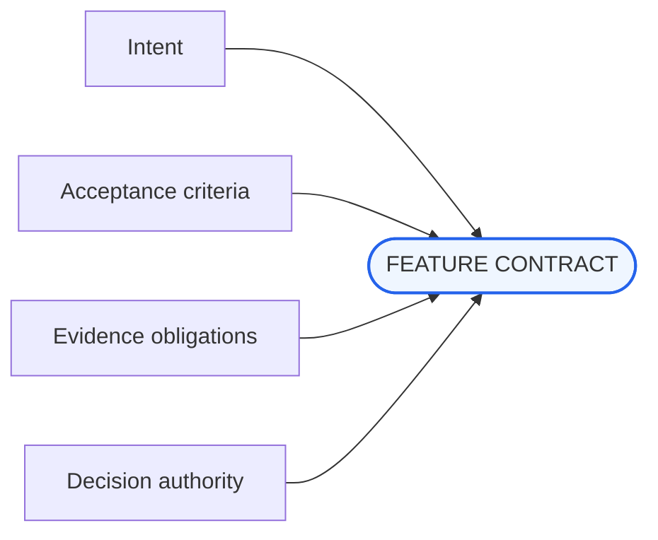
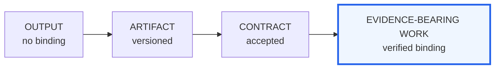

# The Contract Is the Work

## Current imagery and disposition

The current `hero-maturity-model.svg` is an explanatory asset, not a conceptual hero. Replace the opening with a Registry-Wave-aligned hero; retain and restyle the maturity idea as an inline figure. A social card is required (not yet present).

---

## Boards

### contract-hero-binding

| Field | Value |
|---|---|
| id | `contract-hero-binding` |
| class | hero |
| surface | essay |
| scheme | signal-dark |
| variant | single |
| aspect | 16:9; 2400x1350 master |
| status | replace-existing (`hero-maturity-model.svg` used as hero frontispiece) |

**Placement:** Frontispiece, before the opening paragraph; anchor: `”The Contract Is the Work”`

**Purpose:** State that intent gains operational force only when it is bound to acceptance criteria, evidence obligations, and named decision authority — the contract is not the documentation; it is the structure.

**EXACT ON-IMAGE TEXT:**
- `THE CONTRACT IS THE WORK`
- `INTENT`
- `ACCEPTANCE`
- `EVIDENCE`
- `AUTHORITY`

**Element list with positions:**
- ground: signal-dark canvas
- title “THE CONTRACT IS THE WORK”: upper-left, ~10% x / 12% y
- center (~50% x / 50% y): luminous sealed contract record (rectangular or hexagonal object with glow)
- four cardinal rails converging on the central record:
  - top (~50% x / 20% y): “INTENT” label, arrow pointing down
  - right (~82% x / 50% y): “AUTHORITY” label, arrow pointing left
  - bottom (~50% x / 80% y): “EVIDENCE” label, arrow pointing up
  - left (~18% x / 50% y): “ACCEPTANCE” label, arrow pointing right
- rails terminate at the record boundary; the record is sealed by all four
- large negative space around the outside

**Layout diagram:**
```
+-------------------------------------------------------------------+
| THE CONTRACT IS THE WORK                                         |
|                                                                   |
|                          INTENT                                  |
|                            |                                     |
|              ACCEPTANCE -> [CONTRACT] <- AUTHORITY               |
|                            |                                     |
|                          EVIDENCE                                |
|                                                                   |
+-------------------------------------------------------------------+
```

**Conceptual diagram:**


```mermaid
flowchart TD
  I[INTENT] --> CTR
  A[ACCEPTANCE] --> CTR
  E[EVIDENCE] --> CTR
  AU[AUTHORITY] --> CTR
  CTR([CONTRACT\nsealed record])
  style CTR fill:#1e3a5f,stroke:#3b82f6,stroke-width:3
```

**Scheme role slots:** ground=`--s2s-canvas`, ink=`--s2s-ink`, accent-1=`--s2s-accent` (record glow, cardinal arrows), annotation=`--s2s-accent-label` (rail labels), muted=`--s2s-ink-muted` (background field)

**Variant flag:** single

**Alt:** A luminous central contract record is bound by four labeled rails arriving from each cardinal direction: INTENT above, AUTHORITY right, EVIDENCE below, ACCEPTANCE left.

**Caption:** A contract is the structure that makes delegated work governable.

**Generator prompt:** Registry Wave dark editorial systems hero; signal-dark canvas; one central luminous sealed evidence record; four sparse structural rails from cardinal directions labeled INTENT, ACCEPTANCE, EVIDENCE, AUTHORITY; title upper-left; large negative space; no legal paperwork motifs.

**Negative prompt:** legal paperwork, handshakes, signatures, product UI, robots, people, decorative background texture.

**Acceptance checks:**
- Central record dominates the frame
- All four rail labels (INTENT / ACCEPTANCE / EVIDENCE / AUTHORITY) legible
- Rails terminate at the record; the record is enclosed by all four
- Title legible at article width

---

### contract-four-obligations

| Field | Value |
|---|---|
| id | `contract-four-obligations` |
| class | figure |
| surface | essay |
| scheme | paper-light |
| variant | dark+light pair |
| aspect | 16:9; 2000x1125 master |
| status | replace-existing |

**Placement:** After the four-obligations passage; anchor: `”A Feature Contract has four obligations.”`

**Purpose:** Make the four irreducible contract fields visible as a spatial record, so a reader can scan the structure of obligation in one pass.

**EXACT ON-IMAGE TEXT:**
- `FEATURE CONTRACT`
- `Intent`
- `Acceptance criteria`
- `Evidence obligations`
- `Decision authority`

**Element list with positions:**
- center (~50% x / 50% y): “FEATURE CONTRACT” record identifier card (box with label)
- four field cards in quadrant positions:
  - upper-left (~20% x / 25% y): “Intent” card with single connector line to center
  - upper-right (~80% x / 25% y): “Decision authority” card
  - lower-left (~20% x / 75% y): “Acceptance criteria” card
  - lower-right (~80% x / 75% y): “Evidence obligations” card
- connector lines: thin, semantic, from each card to the center record
- no body prose inside cards; label only

**Layout diagram:**
```
+-------------------------------------------------------------------+
|                                                                   |
|  [Intent]                              [Decision authority]      |
|      \                                      /                    |
|       \                                    /                     |
|        +---- [FEATURE CONTRACT] ----------+                      |
|       /                                    \                     |
|      /                                      \                    |
|  [Acceptance criteria]            [Evidence obligations]         |
|                                                                   |
+-------------------------------------------------------------------+
```

**Conceptual diagram:**


**Scheme role slots:** ground=paper-light, ink=`--s2s-ink`, accent-1=`--s2s-accent` (record box border), muted=`--s2s-ink-muted` (connector lines), annotation=`--s2s-accent-label`

**Variant flag:** dark+light pair (field-card color semantics need contrast in both modes)

**Alt:** Four field cards — Intent, Acceptance criteria, Evidence obligations, Decision authority — connect to a central Feature Contract record.

**Caption:** The contract makes intent, verification, and authority visible in the same place.

**Generator prompt:** Registry Wave canonical-record plate; four rounded field cards in quadrant positions; thin semantic connector lines to central record; exact labels only (no body prose); paper-light ground.

**Negative prompt:** lengthy lorem ipsum, app chrome, generic document icon, flowchart process arrows, sequential ordering.

**Acceptance checks:**
- All five label strings present and exact
- Four field cards have equal visual weight
- Record remains visually central
- Connectors read as binding, not sequence

---

### contract-maturity-path

| Field | Value |
|---|---|
| id | `contract-maturity-path` |
| class | figure |
| surface | essay |
| scheme | paper-light |
| variant | single |
| aspect | 16:9; 2000x1125 master |
| status | replace-existing (`hero-maturity-model.svg`) |

**Placement:** Where the current maturity-model SVG appears in the essay; anchor: `”Maturity is evidence-bearing work.”`

**Purpose:** Reframe maturity as increasing verification binding between claims and evidence — not a process trophy or capability ladder.

**EXACT ON-IMAGE TEXT:**
- `OUTPUT`
- `ARTIFACT`
- `CONTRACT`
- `EVIDENCE-BEARING WORK`
- `increasing verification`

**Element list with positions:**
- horizontal path (~15-85% x / 45% y): four stages left-to-right
  - stage 1 (~15% x): “OUTPUT” box
  - stage 2 (~38% x): “ARTIFACT” box
  - stage 3 (~62% x): “CONTRACT” box
  - stage 4 (~85% x): “EVIDENCE-BEARING WORK” box (sealed/closed appearance)
- connector arrows between stages: same weight, no graduation in size
- below stages (~65% y): “increasing verification” annotation spanning the path width, with a left-to-right indicator
- verification thread: a visual line or band that thickens from stage 1 to stage 4 (represents the accumulation of binding)
- no trophy, award, or height-based elevation

**Layout diagram:**
```
+-------------------------------------------------------------------+
|                                                                   |
|   [OUTPUT] ----> [ARTIFACT] ----> [CONTRACT] ----> [EVIDENCE-   |
|                                                    BEARING WORK] |
|                                                                   |
|   ==================== increasing verification ==================|
|   (thin line)                                       (thick line) |
|                                                                   |
+-------------------------------------------------------------------+
```

**Conceptual diagram:**


**Scheme role slots:** ground=paper-light, ink=`--s2s-ink`, accent-1=`--s2s-accent` (final stage border, thick verification thread), muted=`--s2s-ink-muted` (early stage borders, thin thread)

**Variant flag:** single

**Alt:** Four stages progress left to right from OUTPUT to EVIDENCE-BEARING WORK with an “increasing verification” band beneath.

**Caption:** Maturity is not more automation; it is stronger evidence binding.

**Generator prompt:** Registry Wave progression diagram; four equally spaced stages left-to-right; verification thread that thickens across the path; careful pacing — no triumphalist height/size escalation; sealed final record; exact labels; paper-light editorial plate.

**Negative prompt:** maturity ladders with ascending tiers, trophy imagery, percentage scores, gamification, height-based elevation, colored tier backgrounds.

**Acceptance checks:**
- Sequence clearly left-to-right through all four stages
- “increasing verification” label present and positioned under the path
- No implied universal hierarchy beyond the stated verification dimension
- Final stage visually distinct as sealed/closed

---

### contract-social-card

| Field | Value |
|---|---|
| id | `contract-social-card` |
| class | social-card |
| surface | essay |
| scheme | signal-dark |
| variant | single |
| aspect | 1.91:1; 2400x1260 master / 1200x630 render |
| status | required, does not yet exist |

**Placement:** OG/metadata asset. Target: `public/og/posts/the-contract-is-the-work.png`

**EXACT ON-IMAGE TEXT:**
- `The Contract Is the Work`
- `Agentic SDLC`
- `Signal to System`

**Layout diagram:**
```
+-------------------------------------------------------------------+
| [S2S mark]                                                        |
|                                                                   |
|                 The Contract Is the Work                         |
|                       Agentic SDLC                               |
|                                                                   |
|                                         [Signal to System]       |
+-------------------------------------------------------------------+
```

**Scheme role slots:** ground=`--s2s-canvas`, ink=`--s2s-ink`, accent-1=`--s2s-accent`

**Alt:** (metadata only)

**Generator prompt:** Dark editorial social card; essay title and series centered in 70% safe zone; signal-dark canvas; subtle four-rails binding motif; S2S mark.

**Negative prompt:** paper-light background, dense infographic, baked body copy, legal imagery.

**Acceptance checks:**
- Title readable at 1200x630 render within central 70% safe zone
- PNG under 350KB
