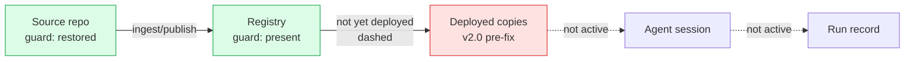
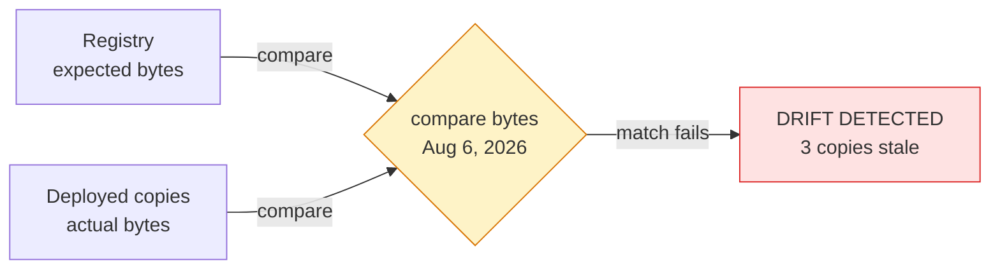
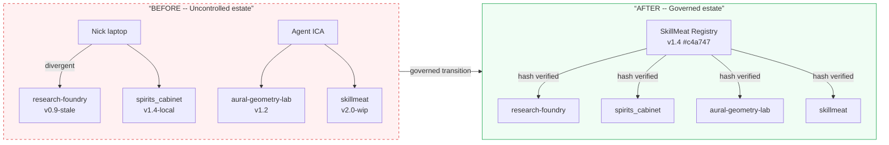
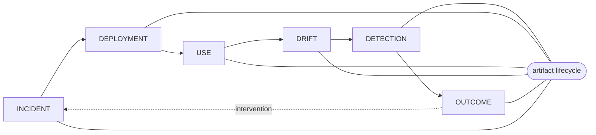

# The Registry Wave: Agentic Artifact Supply Chain

## Current imagery and gaps vs. standards

This essay is the visual authority. The existing asset set is documented below as exemplars. The standards (`graphics-standards-v1.md`) require one `social-card` per essay surface; that is the only class-level gap. The six-thread v2 series (`diagram-thread-01..06-*.svg` in rw-v2-features) has not been promoted to main yet; those are promotion candidates, not gaps.

**Existing assets on main:**
- `hero-governed-cube.png` — hero, paper-light, no dark-mode variant (gap: missing dark+light pair per variant policy)
- `diagram-artifact-taxonomy.svg` — figure
- `diagram-registry-control-plane.svg` — figure
- `diagram-intent-outcome-chain.svg` — figure
- `agentic-os-artifact-estate-before-and-after.png` — figure (also in rw-v2-essay)
- `registry-wave-incident-resolution-flow.png` — figure (Thread 01)
- `registry-wave-from-source-to-outcome.png` — figure (Thread 02 Deployment)
- `registry-wave-presence-vs-behavior.png` — figure (Thread 03 Use)
- `registry-wave-drift-across-five-days.png` — figure (Thread 04 Drift)
- `registry-wave-detecting-silent-drift.png` — figure (Thread 05 Detection)
- `registry-wave-run-level-provenance-infographic.png` — figure (Thread 06 Outcome)
- `not-every-difference-is-drift.png` — figure (in rw-v2-essay)
- `some-copies-must-change.png` — illustration (in rw-v2-essay; near-square, ~1:1)
- `the-agentic-os-artifact-estate.png` — figure (in rw-v2-essay)

**Gaps against standards:**
1. No `social-card` (required R:1 per essay surface matrix) — see board below.
2. Hero has no `dark+light pair` variant — the governed-cube hero is paper-light only; no signal-dark companion exists.
3. `some-copies-must-change.png` is near-square (~1:1) but would function as an illustration. No 1.91:1 social card exists as a separate asset.
4. v2-features thread SVGs (`diagram-thread-01..06`) and `diagram-market-wave.svg` / `diagram-estate-before-after.svg` are not yet promoted to main.

Do not replace the main hero without visual regression review. Promote the v2-features thread SVGs as a single batch when approved.

---

## Existing imagery documented as exemplars

### rw-hero-governed-cube (existing, exemplar)

| Field | Value |
|---|---|
| id | `rw-hero-governed-cube` |
| class | hero |
| surface | essay |
| scheme | paper-light |
| variant | single (no dark companion exists) |
| aspect | 16:9; 2400x1350 master |
| status | existing / do not replace without regression review |

**Placement:** Essay frontispiece, before the opening paragraph.

**Purpose:** Establish the governing metaphor: a registry is a distribution hub that pushes identical governed artifacts to local workers (agents and humans), not a store for independent copies.

**EXACT ON-IMAGE TEXT:** (none baked in — purely visual)

**Element list with positions:**
- upper-center (50% x / 28% y): hub document-with-cube icon on a cylindrical base
- upper-left bg (~15% x / 25% y): faint graph network of circles and lines
- upper-right bg (~80% x / 25% y): faint document fan array with dashed connectors to hub
- mid-band four nodes (~20%, 35%, 65%, 80% x / ~42% y): dashed-border circles each containing a colored cube variant
- navy arcs with orange waypoint dots connecting hub to each circle
- lower half: four workers at drafting tables, each holding a physical cube, evenly distributed
- outer edges: foliage/plants (atmospheric warmth)

**Layout diagram:**
```
+-------------------------------------------------------------------+
| [faint graph net]   [HUB: doc-cube icon on base]   [doc fans]   |
|                  \  arc arcs radiate outward  /                   |
|           [o:white]-o-[o:copper]-o-[o:blue]-o-[o:navy]           |
|           /dashed arrows descend to workers below\               |
| [plant] [worker+desk] [worker+desk] [worker+desk] [worker+desk]  |
+-------------------------------------------------------------------+
```

**Scheme role slots:** ground=paper-light, ink=navy (`--s2s-ink`), accent-1=electric-blue (`--s2s-accent`), accent-2=copper/orange (`--s2s-secondary`), muted=warm-grey (`--s2s-ink-muted`)

**Alt:** A network radiates governed artifact copies from a central hub to four workers at drafting tables, each receiving an identical cube.

**Caption:** (no default caption for hero)

---

### rw-figure-thread-01-incident (existing, exemplar)

| Field | Value |
|---|---|
| id | `rw-figure-thread-01-incident` |
| class | figure |
| surface | essay |
| scheme | paper-light |
| variant | single |
| aspect | 16:9; ~1456x816 (render); 2400x1350 master recommended |
| status | existing |

**Placement:** After the incident framing passage; anchor: `”The fix exists upstream, but deployed copies are still old.”`

**Purpose:** Show that source and registry can be corrected before any deployed copy receives the fix.

**EXACT ON-IMAGE TEXT:**
- `THE REGISTRY WAVE`
- `Registry Wave -- 01 Incident`
- `The fix exists upstream, but deployed copies are still old.`
- `01 Source repo` · `02 Registry` · `03 Deployed copies` · `04 Agent session` · `05 Run record`
- `Canonical source of the code or content.` · `Versioned, governed record of artifacts.`
- `v2.0, pre-fix.` · `Not active in this incident.` (x2)
- `Reviewer-skill guard restored in source.`
- `guard: restored` · `guard: present` · `not yet deployed`
- `KEY POINT`
- `A fix can exist in the source and registry before any deployed copy receives it.`
- `IDEAS / SYSTEMS / EVIDENCE / OUTCOMES`
- `TRUST / TRANSPARENCY / COMPOUNDING / VALUE`
- `SAME LINEAGE. BRIGHTER OUTCOMES.`

**Element list with positions:**
- top-left corner: stacked vertical tags (IDEAS / SYSTEMS / EVIDENCE / OUTCOMES)
- top-center: “THE REGISTRY WAVE” small-caps
- top-right: “A MORE CAPABLE / TOMORROW”
- title row: “Registry Wave -- 01 Incident” (NN in orange)
- subtitle row: descriptive sentence
- pipeline: 5 numbered circle nodes, horizontal, with orange waypoint dots between
- node 1 (Source repo): green border, green checkmark in upper-right
- node 2 (Registry): green border, green checkmark
- dashed orange arc between node 2 and 3, with “not yet deployed” annotation
- node 3 (Deployed copies): red border, X mark
- nodes 4+5 (Agent session, Run record): grey/inactive
- lower half: key-point card with lightbulb icon + large text
- footer: “SAME LINEAGE. BRIGHTER OUTCOMES.” with orange bullet at center

**Layout diagram:**
```
+-------------------------------------------------------------------+
| IDEAS/...    THE REGISTRY WAVE    A MORE CAPABLE TOMORROW        |
|              “Registry Wave -- 01 Incident”                      |
|    “The fix exists upstream, but deployed copies are still old.” |
|                                                                   |
|  01            02      --not yet--   03           04       05    |
| [O check]--o--[O check]--o(dashed)--[X red]--o--[grey]--o-[grey]|
|  Source        Registry               Deployed   Agent    Run    |
|  repo          guard:present         copies     session  record  |
|                                                                   |
| +----------------------------------------------------------+     |
| | KEY POINT (lightbulb icon)                              |     |
| | “A fix can exist in the source and registry             |     |
| |  before any deployed copy receives it.”                 |     |
| +----------------------------------------------------------+     |
|                                                                   |
| PEOPLE/TOOLS... ---o--- SAME LINEAGE. BRIGHTER OUTCOMES.        |
+-------------------------------------------------------------------+
```

**Conceptual diagram:**


**Scheme role slots:** ground=paper-light, ink=`--s2s-ink`, accent-2=`--s2s-secondary` (orange waypoints), highlight=green (ok nodes), warning=red (failed node)

**Alt:** A five-node supply chain pipeline shows the source and registry corrected with green checkmarks, while the deployed copies node shows a red X and a “not yet deployed” annotation.

**Caption:** A fix can exist in the source and registry before any deployed copy receives it.

---

### rw-figure-thread-05-detection (existing, exemplar for the beat-specific lower section)

| Field | Value |
|---|---|
| id | `rw-figure-thread-05-detection` |
| class | figure |
| surface | essay |
| scheme | paper-light |
| variant | single |
| aspect | 16:9 |
| status | existing |

**Placement:** Anchor: `”A deterministic byte comparison can expose silent drift.”`

**EXACT ON-IMAGE TEXT:**
- `Registry Wave -- 05 Detection`
- `A deterministic byte comparison can expose silent drift.`
- `01 Source repo` (through) `05 Run record` (pipeline labels)
- `Aug 6, 2026`
- `expected bytes` · `compare bytes` · `actual bytes`
- `DRIFT DETECTED -- 3 copies stale`
- `SAME LINEAGE. BRIGHTER OUTCOMES.`

**Element list with positions:**
- Standard pipeline header (same as 01 above)
- Node 3 (Deployed copies): highlighted with red dashed border; other nodes neutral
- Lower center: diamond decision shape labeled “compare bytes”, with left arrow “expected bytes” from node 2, right arrow “actual bytes” from node 4, date “Aug 6, 2026” above
- Lower full-width: red banner rounded-rect “DRIFT DETECTED -- 3 copies stale” with red exclamation icon

**Layout diagram:**
```
+-------------------------------------------------------------------+
|  [standard header template]                                      |
|                                                                   |
|  01       02            (03 highlighted)       04         05    |
| [O]--o--[O]---o------[X red dashed]------o--[O]---o---[O]       |
|                                                                   |
|            expected bytes -->                                    |
|                       [diamond: compare bytes]                   |
|                         <-- actual bytes                         |
|                    “Aug 6, 2026”                                  |
|                                                                   |
| +--- DRIFT DETECTED -- 3 copies stale (red banner) -----------+ |
+-------------------------------------------------------------------+
```

**Conceptual diagram:**


**Alt:** A five-node pipeline highlights the deployed copies node as the comparison point; a diamond shows expected vs actual bytes; a red banner reads “DRIFT DETECTED -- 3 copies stale.”

**Caption:** A deterministic byte comparison can expose silent drift.

---

### rw-figure-before-after (existing, exemplar)

| Field | Value |
|---|---|
| id | `rw-figure-before-after` |
| class | figure |
| surface | essay |
| scheme | paper-light |
| variant | single |
| aspect | 16:9 |
| status | existing |

**Placement:** After the estate framing; anchor: `”From uncontrolled copies to governed deployment.”`

**EXACT ON-IMAGE TEXT:**
- `THE REGISTRY WAVE` · `One Estate, Before and After`
- `From uncontrolled copies to governed deployment.`
- `BEFORE -- Uncontrolled estate` · `AFTER -- Governed estate`
- `Multiple local copies, divergent versions, no single source of truth.`
- `One source of authority. Verified deployments of the same bytes.`
- `Nick · laptop / DEVELOPER / MAKES LOCAL CHANGES`
- `Agent · ICA / AUTONOMOUS AGENT / WORKS ACROSS PROJECTS`
- `SkillMeat Registry / Canonical artifact store with versioning and lineage.`
- `evidence-reviewer v1.4 #c4a747` · `VERSIONED / VERIFIED / TRACEABLE / DEPLOYABLE`
- `VERSION DRIFT / Same artifact, different versions.`
- `NO VERIFICATION / No way to ensure what's deployed.`
- `FRAGMENTED KNOWLEDGE / Changes live in silos, hard to reconcile.`
- `SAME BYTES EVERYWHERE / Identical, verified copies deployed to each project.`
- `AUDITABLE LINEAGE / Know what's deployed, where, and from what version.`
- `SAFE EVOLUTION / New versions through governed releases.`
- `Distributed uncontrolled copies --> one source of authority + verifiable deployments.`

**Layout diagram:** (see 00-style-reference.md for full grid)

**Conceptual diagram:**


**Scheme role slots:** ground=paper-light, ink=`--s2s-ink`, accent-2=`--s2s-secondary`, warning=red, success=green

**Alt:** A before/after comparison shows four repositories with divergent artifact versions on the left and a SkillMeat Registry distributing identical hash-verified copies on the right.

**Caption:** Distributed uncontrolled copies become one source of authority with verifiable deployments.

---

## New board

### rw-social-card — REQUIRED, net-new

| Field | Value |
|---|---|
| id | `rw-social-card` |
| class | social-card |
| surface | essay |
| scheme | signal-dark |
| variant | single |
| aspect | 1.91:1; 2400x1260 master / 1200x630 render |
| status | required, does not yet exist |

**Placement:** OG/metadata asset for the essay URL; not rendered inline. Target: `public/og/posts/the-registry-wave-agentic-artifact-supply-chain.png`

**Purpose:** Represent the essay in social feeds and link previews with the essay title and series mark.

**EXACT ON-IMAGE TEXT:**
- `THE REGISTRY WAVE`
- `Agentic Artifact Supply Chain`
- `Signal to System`

**Element list with positions:**
- ground: signal-dark canvas (`--s2s-canvas`)
- center zone (within 70% of frame width): essay title text block
- upper-left or lower-right: S2S mark / series mark
- accent rule or subtle network motif (low density, not a full diagram)

**Layout diagram:**
```
+-------------------------------------------------------------------+
|                                                                   |
|   [S2S mark small]                                               |
|                                                                   |
|              THE REGISTRY WAVE                                   |
|         Agentic Artifact Supply Chain                            |
|                                                                   |
|                                              [Signal to System]  |
+-------------------------------------------------------------------+
```

**Scheme role slots:** ground=`--s2s-canvas`, ink=`--s2s-ink`, accent-1=`--s2s-accent`, accent-2=`--s2s-secondary`

**Variant flag:** single

**Alt:** (metadata only — not content image)

**Caption:** (none — metadata asset)

**Generator prompt:** Registry Wave dark social card; observatory-ground canvas; series title centered in 70% safe zone; S2S mark; subtle governed-network motif; no dense diagram.

**Negative prompt:** dense infographic, baked body copy, logos other than S2S mark, screenshotted UI.

**Acceptance checks:**
- All three text strings present and readable at 1200x630 render
- Title within central 70% safe zone
- Signal-dark ground; no paper-light bleed
- PNG export under 350KB

---

### registry-threaded-control-loop — optional net-new / promotion candidate

| Field | Value |
|---|---|
| id | `registry-threaded-control-loop` |
| class | illustration |
| surface | essay |
| scheme | paper-light |
| variant | dark+light pair |
| aspect | 16:9; 2400x1350 master |
| status | optional net-new / promotion candidate |

**Placement:** After the supply-chain framing; anchor: `”An artifact has a life after publication.”`

**Purpose:** Consolidate lifecycle accountability across the six thread beats into one closed-loop visual.

**EXACT ON-IMAGE TEXT:**
- `INCIDENT`
- `DEPLOYMENT`
- `USE`
- `DRIFT`
- `DETECTION`
- `OUTCOME`
- `artifact lifecycle`

**Element list with positions:**
- center: governed artifact record box labeled “artifact lifecycle”
- six numbered modules arranged in a clockwise ring around the center
- each module has one inbound and one outbound directed connector
- DETECTION has a visibly returning connector to INCIDENT (intervention, not mere observation)

**Layout diagram:**
```
+-------------------------------------------------------------------+
|                                                                   |
|             [INCIDENT]  -->  [DEPLOYMENT]                        |
|              ^                      |                            |
|              |                      v                            |
|          [DETECTION]   [artifact lifecycle]   [USE]              |
|              ^                      |                            |
|              |                      v                            |
|             [OUTCOME]  <--  [DRIFT]                              |
|                                                                   |
+-------------------------------------------------------------------+
```

**Conceptual diagram:**


**Scheme role slots:** ground=paper-light (or canvas for dark variant), ink=`--s2s-ink`, accent-1=`--s2s-accent`, accent-2=`--s2s-secondary`

**Alt:** Six lifecycle stages form a closed loop around a governed artifact record.

**Caption:** A registry wave is a lifecycle of accountable change, not a publication event.

**Generator prompt:** Registry Wave modular editorial lifecycle illustration; six restrained labeled stages in a clockwise ring; central governed record; explicit return connector from DETECTION to INCIDENT; print-like technical quality; paper-light ground.

**Negative prompt:** circular arrows without state boundaries, dashboards, supply-chain stock photos, logos, dense prose labels.

**Acceptance checks:**
- Six labels exact
- Loop direction obvious clockwise
- DETECTION return connector visually distinct (dashed or contrasting)
- Compatible with existing Registry Wave figure family (same ground, same connector language)
