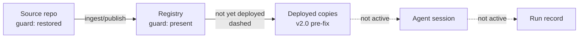
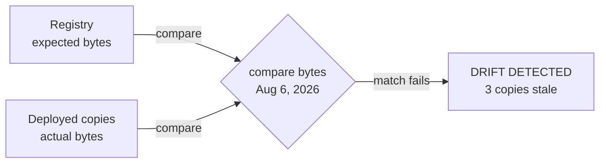
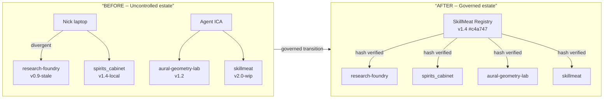

# The Registry Wave: Agentic Artifact Supply Chain — storyboard

Essay: `src/content/posts/the-registry-wave-agentic-artifact-supply-chain.mdx` (main and
`rw-v2-essay`). This essay **is** the visual authority; `00-style-reference.md` documents it.
Nothing here re-art-directs the existing plates.

## Disposition

| Asset | Decision |
|---|---|
| `hero-governed-cube.png` | **Keep** as the paper-light master. **Add** its night twin, `rw-hero-night` (required by the pair policy, standards §4). |
| Thread plates 01-06, before/after, estate map | **Keep.** Exemplars. |
| `some-copies-must-change.png` | **Keep.** Thesis-plate exemplar (illustration class). The file ships in the asset folder, but neither essay version places it today (unplaced exemplar). |
| `not-every-difference-is-drift.png` | **Keep in the essay; optional re-set** (`rw-plate-not-every-difference`, below). Its content is right; its type and frame are off-family. |
| `diagram-*.svg`, `diagram-thread-0N-*.svg` | Coded twins. Promotion is a separate decision (rw-v2-features); not a style question. |
| social art | **New**, `rw-social`, cut from the night twin. |

Cut from the first draft: `registry-threaded-control-loop`. The six-thread series already *is*
the lifecycle, a ring restating it adds nothing, the draft's layout, text and Mermaid disagreed
on which stage loops back, and "illustration" was the wrong class for a labelled diagram.

## Existing imagery documented as exemplars

### rw-hero-governed-cube (existing, exemplar)

| Field | Value |
|---|---|
| id | `rw-hero-governed-cube` |
| class | hero |
| surface | essay |
| scheme | paper-light |
| variant | single (no dark companion exists) |
| aspect | 16:9; 2400x1350 master |
| status | existing / do not replace without regression review |

**Placement:** Essay frontispiece, before the opening paragraph.

**Purpose:** Establish the governing metaphor: a registry is a distribution hub that pushes identical governed artifacts to local workers (agents and humans), not a store for independent copies.

**EXACT ON-IMAGE TEXT:** (none baked in — purely visual)

**Element list with positions:**
- upper-center (50% x / 28% y): hub document-with-cube icon on a cylindrical base
- upper-left bg (~15% x / 25% y): faint graph network of circles and lines
- upper-right bg (~80% x / 25% y): faint document fan array with dashed connectors to hub
- mid-band four nodes (~20%, 35%, 65%, 80% x / ~42% y): dashed-border circles each containing a colored cube variant
- navy arcs with copper-centred waypoint rings connecting hub to each circle
- lower half: four workers at drafting tables, each holding a physical cube, evenly distributed
- outer edges: foliage/plants (atmospheric warmth)

**Layout diagram:**
```
+-------------------------------------------------------------------+
| [faint graph net]   [HUB: doc-cube icon on base]   [doc fans]   |
|                  \  arc arcs radiate outward  /                   |
|           [o:white]-o-[o:copper]-o-[o:blue]-o-[o:navy]           |
|           /dashed arrows descend to workers below\               |
| [plant] [worker+desk] [worker+desk] [worker+desk] [worker+desk]  |
+-------------------------------------------------------------------+
```

**Scheme role slots:** ground=paper-light (warm cream), ink=navy, accent-1=cobalt (governed cube solids), accent-2=copper (one cube, waypoint centres), muted=warm grey. Role names per `../graphics-standards-v1.md` §3.1; not site tokens.

**Alt:** A network radiates governed artifact copies from a central hub to four workers at drafting tables, each receiving an identical cube.

**Caption:** (no default caption for hero)

---

### rw-figure-thread-01-incident (existing, exemplar)

| Field | Value |
|---|---|
| id | `rw-figure-thread-01-incident` |
| class | figure |
| surface | essay |
| scheme | paper-light |
| variant | single |
| aspect | 16:9; ~1456x816 (render); 2400x1350 master recommended |
| status | existing |

**Placement:** After the incident framing passage; anchor: `”The fix exists upstream, but deployed copies are still old.”`

**Purpose:** Show that source and registry can be corrected before any deployed copy receives the fix.

**EXACT ON-IMAGE TEXT:**
- `THE REGISTRY WAVE`
- `Registry Wave -- 01 Incident`
- `The fix exists upstream, but deployed copies are still old.`
- `01 Source repo` · `02 Registry` · `03 Deployed copies` · `04 Agent session` · `05 Run record`
- `Canonical source of the code or content.` · `Versioned, governed record of artifacts.`
- `v2.0, pre-fix.` · `Not active in this incident.` (x2)
- `Reviewer-skill guard restored in source.`
- `guard: restored` · `guard: present` · `not yet deployed`
- `KEY POINT`
- `A fix can exist in the source and registry before any deployed copy receives it.`
- `IDEAS / SYSTEMS / EVIDENCE / OUTCOMES`
- `TRUST / TRANSPARENCY / COMPOUNDING / VALUE`
- `SAME LINEAGE. BRIGHTER OUTCOMES.`

**Element list with positions:**
- top-left corner: stacked vertical tags (IDEAS / SYSTEMS / EVIDENCE / OUTCOMES)
- top-center: “THE REGISTRY WAVE” small-caps
- top-right: “A MORE CAPABLE / TOMORROW”
- title row: “Registry Wave -- 01 Incident” (NN and beat name in copper)
- subtitle row: descriptive sentence
- pipeline: 5 numbered circle nodes, horizontal, with copper-centred waypoint rings between
- node 1 (Source repo): green border, green checkmark in upper-right
- node 2 (Registry): green border, green checkmark
- dashed copper connector between node 2 and 3, with “not yet deployed” annotation
- node 3 (Deployed copies): red border, X mark
- nodes 4+5 (Agent session, Run record): grey/inactive
- lower half: key-point card with lightbulb icon + large text
- footer: “SAME LINEAGE. BRIGHTER OUTCOMES.” with copper rule-end dots at center

**Layout diagram:**
```
+-------------------------------------------------------------------+
| IDEAS/...    THE REGISTRY WAVE    A MORE CAPABLE TOMORROW        |
|              “Registry Wave -- 01 Incident”                      |
|    “The fix exists upstream, but deployed copies are still old.” |
|                                                                   |
|  01            02      --not yet--   03           04       05    |
| [O check]--o--[O check]--o(dashed)--[X red]--o--[grey]--o-[grey]|
|  Source        Registry               Deployed   Agent    Run    |
|  repo          guard:present         copies     session  record  |
|                                                                   |
| +----------------------------------------------------------+     |
| | KEY POINT (lightbulb icon)                              |     |
| | “A fix can exist in the source and registry             |     |
| |  before any deployed copy receives it.”                 |     |
| +----------------------------------------------------------+     |
|                                                                   |
| PEOPLE/TOOLS... ---o--- SAME LINEAGE. BRIGHTER OUTCOMES.        |
+-------------------------------------------------------------------+
```

**Conceptual diagram:**


**Scheme role slots:** ground=paper-light, ink=navy, accent-2=copper (beat number, waypoint centres, rules), state-ok=green, state-danger=red, state-inactive=empty ring.

**Alt:** A five-node supply chain pipeline shows the source and registry corrected with green checkmarks, while the deployed copies node shows a red X and a “not yet deployed” annotation.

**Caption:** A fix can exist in the source and registry before any deployed copy receives it.

---

### rw-figure-thread-05-detection (existing, exemplar for the beat-specific lower section)

| Field | Value |
|---|---|
| id | `rw-figure-thread-05-detection` |
| class | figure |
| surface | essay |
| scheme | paper-light |
| variant | single |
| aspect | 16:9 |
| status | existing |

**Placement:** Anchor: `”A deterministic byte comparison can expose silent drift.”`

**EXACT ON-IMAGE TEXT:**
- `Registry Wave -- 05 Detection`
- `A deterministic byte comparison can expose silent drift.`
- `01 Source repo` (through) `05 Run record` (pipeline labels)
- `Aug 6, 2026`
- `expected bytes` · `compare bytes` · `actual bytes`
- `DRIFT DETECTED -- 3 copies stale`
- `SAME LINEAGE. BRIGHTER OUTCOMES.`

**Element list with positions:**
- Standard pipeline header (same as 01 above)
- Node 3 (Deployed copies): highlighted with red dashed border; other nodes neutral
- Lower center: diamond decision shape labeled “compare bytes”, with left arrow “expected bytes” from node 2, right arrow “actual bytes” from node 4, date “Aug 6, 2026” above
- Lower full-width: red banner rounded-rect “DRIFT DETECTED -- 3 copies stale” with red exclamation icon

**Layout diagram:**
```
+-------------------------------------------------------------------+
|  [standard header template]                                      |
|                                                                   |
|  01       02            (03 highlighted)       04         05    |
| [O]--o--[O]---o------[X red dashed]------o--[O]---o---[O]       |
|                                                                   |
|            expected bytes -->                                    |
|                       [diamond: compare bytes]                   |
|                         <-- actual bytes                         |
|                    “Aug 6, 2026”                                  |
|                                                                   |
| +--- DRIFT DETECTED -- 3 copies stale (red banner) -----------+ |
+-------------------------------------------------------------------+
```

**Conceptual diagram:**


**Alt:** A five-node pipeline highlights the deployed copies node as the comparison point; a diamond shows expected vs actual bytes; a red banner reads “DRIFT DETECTED -- 3 copies stale.”

**Caption:** A deterministic byte comparison can expose silent drift.

---

### rw-figure-before-after (existing, exemplar)

| Field | Value |
|---|---|
| id | `rw-figure-before-after` |
| class | figure |
| surface | essay |
| scheme | paper-light |
| variant | single |
| aspect | 16:9 |
| status | existing |

**Placement:** After the estate framing; anchor: `”From uncontrolled copies to governed deployment.”`

**EXACT ON-IMAGE TEXT:**
- `THE REGISTRY WAVE` · `One Estate, Before and After`
- `From uncontrolled copies to governed deployment.`
- `BEFORE -- Uncontrolled estate` · `AFTER -- Governed estate`
- `Multiple local copies, divergent versions, no single source of truth.`
- `One source of authority. Verified deployments of the same bytes.`
- `Nick · laptop / DEVELOPER / MAKES LOCAL CHANGES`
- `Agent · ICA / AUTONOMOUS AGENT / WORKS ACROSS PROJECTS`
- `SkillMeat Registry / Canonical artifact store with versioning and lineage.`
- `evidence-reviewer v1.4 #c4a747` · `VERSIONED / VERIFIED / TRACEABLE / DEPLOYABLE`
- `VERSION DRIFT / Same artifact, different versions.`
- `NO VERIFICATION / No way to ensure what's deployed.`
- `FRAGMENTED KNOWLEDGE / Changes live in silos, hard to reconcile.`
- `SAME BYTES EVERYWHERE / Identical, verified copies deployed to each project.`
- `AUDITABLE LINEAGE / Know what's deployed, where, and from what version.`
- `SAFE EVOLUTION / New versions through governed releases.`
- `Distributed uncontrolled copies --> one source of authority + verifiable deployments.`

**Layout diagram:** (see 00-style-reference.md for full grid)

**Conceptual diagram:**


**Scheme role slots:** ground=paper-light, ink=navy, accent-2=copper (accent phrase, centre arrow), state-danger=red (BEFORE), state-ok=green (AFTER).

**Alt:** A before/after comparison shows four repositories with divergent artifact versions on the left and a SkillMeat Registry distributing identical hash-verified copies on the right.

**Caption:** Distributed uncontrolled copies become one source of authority with verifiable deployments.

---

## New boards

### rw-hero-night — night twin of the governed cube (required)

| Field | Value |
|---|---|
| class / surface | hero / essay |
| template | §3 night twin, generated as an **edit of** `hero-governed-cube.png` |
| scheme / variant | signal-dark / second half of the pair |
| master | 16:9, 2400x1350 (match the master's framing exactly) |
| exact text | none |
| target | `public/images/the-registry-wave-agentic-artifact-supply-chain/hero/the-registry-wave-agentic-artifact-supply-chain--hero--governed-cube--signal-dark.{avif,webp}` (the existing PNG becomes the `--paper-light` half) |

**Recipe specifics:** windows at left show a violet night sky with a scatter of stars; the four
workers are lit by warm desk lamps; the hub, arcs, and four badges become pale luminous ink with
a soft glow; cobalt cubes lean violet-blue; the copper cube and waypoints glow copper. Plants,
shelves, and foreground table stay, unlit. No element added or removed.

**Checks:** overlay aligns with the master when the two are toggled; overlay >= 3:1 on the dark
surround; faces and hands readable; no text.

---

### rw-social — social art

1520x1260, signal-dark, no text, recropped from the approved `rw-hero-night`: the hub and two
right-hand badges with their workers in the right 60%. Target:
`public/images/the-registry-wave-agentic-artifact-supply-chain/social/the-registry-wave-agentic-artifact-supply-chain--social-card--art.jpg`.
The renderer (`src/lib/og/render.ts`) sets title and mark.

---

### rw-plate-not-every-difference — family re-set (optional)

**What changes:** only type and frame. Keep the content structure exactly (upstream source →
curated collection → three project rows of intended / deployed / runtime → decision card; the
legend). Apply T2's `plate-frame` (eyebrow `THE REGISTRY WAVE`, the Registry Wave corner stacks,
footer rule) and the serif title rule.

**Exact text changes:** title becomes `Not Every Difference Is Drift` in the serif display,
`Drift` in accent-2 (sentence case, not all caps); subtitle `Same lineage. Different reasons.
Different actions.` in the wide-tracked sans; footer tagline `SOME COPIES MUST CHANGE. SOME
DIFFERENCES MUST SURVIVE.` Every other string stays byte-identical to the current PNG.

**Checks:** a side-by-side with `registry-wave-presence-vs-behavior.png` reads as one family;
all version strings unchanged.
